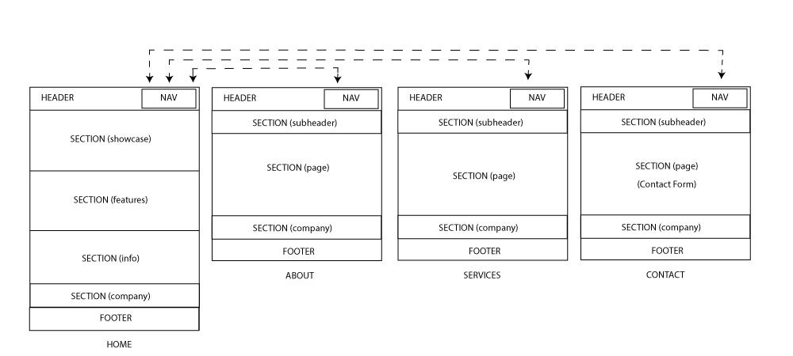

# Development Strategy

> `AppThemet`

write a short description of your project:
- This project is meant to learn the basic aspects of HTML /  CSS / GIT
- Everybody who would like to see the semantics used on the project or the branching settings would be able to analise this on this project.

## Wireframe

## 0. Set-Up

__A User can see my initial repository and live demo__

### Repo

- Generate from Template
- Branch 0-set-up
- Write initial, basic README
- Turn on GitHub Pages
- Set the folder structure
- Copy the css required files
- Create the style.css file
- Import the pictures used on the project

## 1. Basic Structure

__As a site visitor, I can see a basic structure for the web site__

### Repo

- Branch 1-basic-structure

### HTML

- Develop the full HTML for the index.html file

### CSS

- Nothing

## 2. Styling Index

__As a site visitor, I can see the website, already with the styling__

### Repo

- Branch 2-index-style

### HTML

- Nothing.

### CSS

- Develop the needed CSS content for the index.html file.

## 3. About page

__As a site visitor, I can see a basic structure for the About page__

### Repo

- Branch 3-about-page

### HTML

- Develop the full HTML for the about.html file.

### CSS

- Nothing

## 4. Styling About Page

__As a site visitor, I can see the page About of the website, already with the styling__

### Repo

- Branch 4-about-style

### HTML

- Nothing.

### CSS

- Develop the needed CSS content for the about.html file.

## 5. Services page

__As a site visitor, I can see a basic structure for the Services page__

### Repo

- Branch 5-services-page

### HTML

- Develop the full HTML for the services.html file.

### CSS

- Nothing

## 6. Styling Services Page

__As a site visitor, I can see the page Services of the website, already with the styling__

### Repo

- Branch 6-services-style

### HTML

- Nothing.

### CSS

- Develop the needed CSS content for the services.html file.

## 7. Contact page

__As a site visitor, I can see a basic structure for the Contact page__

### Repo

- Branch 7-contact-page

### HTML

- Develop the full HTML for the contact.html file.

### CSS

- Nothing

## 8. Styling Contact Page

__As a site visitor, I can see the page Contact of the website, already with the styling__

### Repo

- Branch 8-contact-style

### HTML

- Nothing.

### CSS

- Develop the needed CSS content for the contact.html file.

## 9. Adding Media Queries

__As a site visitor, I can see the website in a responsive way__

### Repo

- Branch 9-media-queries

### HTML

- Nothing.

### CSS

- Develop the needed media queries for responsiveness.

## Finishing Touches

### Repo

- Branch 10-finishing
- Write final, complete README:
- Validate code to check for any last mistakes
